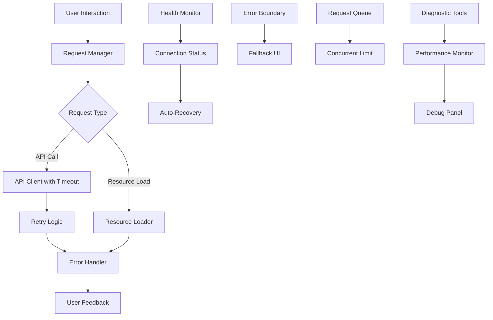

# Design Document

## Overview

The frontend hanging issue appears to be caused by multiple factors including network request handling, proxy configuration problems, resource loading issues, and insufficient error boundaries. The solution involves implementing robust error handling, request management, timeout controls, and comprehensive logging to ensure the application remains responsive under all conditions.

## Architecture

### Current Issues Identified

1. **Network Request Hanging**: API requests may hang indefinitely without proper timeout handling
2. **Proxy Configuration**: Vite proxy may have connection issues with the backend
3. **Error Boundary Gaps**: Some components may not be properly wrapped in error boundaries
4. **Resource Loading**: Static resources or chunks may fail to load causing application freeze
5. **State Management**: Redux state updates may cause rendering loops or blocking operations
6. **Memory Leaks**: Unhandled promises or event listeners may accumulate over time

### Solution Architecture



## Components and Interfaces

### 1. Enhanced Request Manager

**Purpose**: Centralized request handling with timeout, retry, and cancellation support

**Interface**:
```javascript
class RequestManager {
  async makeRequest(config, options = {})
  cancelRequest(requestId)
  cancelAllRequests()
  getActiveRequests()
  setGlobalTimeout(timeout)
}
```

**Features**:
- Request queuing and concurrent request limiting
- Automatic timeout handling (configurable per request)
- Request cancellation support using AbortController
- Retry logic with exponential backoff
- Request deduplication to prevent duplicate calls

### 2. Connection Health Monitor

**Purpose**: Monitor backend connectivity and provide real-time status

**Interface**:
```javascript
class HealthMonitor {
  startMonitoring()
  stopMonitoring()
  getConnectionStatus()
  onStatusChange(callback)
  forceHealthCheck()
}
```

**Features**:
- Periodic health checks to backend
- Connection status indicators in UI
- Automatic reconnection attempts
- Offline/online detection

### 3. Enhanced Error Boundaries

**Purpose**: Catch and handle React errors gracefully

**Components**:
- `GlobalErrorBoundary`: Top-level error catching
- `RouteErrorBoundary`: Route-specific error handling
- `ComponentErrorBoundary`: Component-level error isolation

**Features**:
- Error reporting and logging
- Fallback UI components
- Error recovery mechanisms
- User-friendly error messages

### 4. Request Timeout Controller

**Purpose**: Prevent hanging requests with configurable timeouts

**Configuration**:
```javascript
const timeoutConfig = {
  chat: 30000,      // 30s for chat messages
  health: 5000,     // 5s for health checks
  default: 15000    // 15s default timeout
}
```

### 5. Diagnostic Dashboard

**Purpose**: Real-time monitoring and debugging tools

**Features**:
- Active request monitoring
- Network status display
- Error log viewer
- Performance metrics
- Manual request testing

## Data Models

### Request State Model
```javascript
{
  id: string,
  url: string,
  method: string,
  status: 'pending' | 'success' | 'error' | 'timeout' | 'cancelled',
  startTime: timestamp,
  endTime: timestamp,
  retryCount: number,
  error: ErrorObject | null
}
```

### Connection Status Model
```javascript
{
  isOnline: boolean,
  backendStatus: 'connected' | 'disconnected' | 'slow' | 'unknown',
  lastHealthCheck: timestamp,
  responseTime: number,
  errorCount: number
}
```

### Error Report Model
```javascript
{
  id: string,
  timestamp: timestamp,
  type: 'network' | 'runtime' | 'render' | 'timeout',
  message: string,
  stack: string,
  context: object,
  userAgent: string,
  url: string
}
```

## Error Handling

### Error Categories and Responses

1. **Network Errors**
   - Timeout: Show retry button with countdown
   - Connection refused: Show offline indicator
   - DNS errors: Show connectivity check

2. **API Errors**
   - 5xx errors: Show server error message with retry
   - 4xx errors: Show user error message
   - Rate limiting: Show wait message with countdown

3. **Runtime Errors**
   - Component crashes: Show error boundary fallback
   - Memory issues: Show page refresh suggestion
   - Script loading: Show reload prompt

4. **Proxy Errors**
   - Proxy timeout: Fallback to direct connection
   - Proxy misconfiguration: Log detailed error info

### Error Recovery Strategies

1. **Automatic Recovery**
   - Retry failed requests with exponential backoff
   - Reconnect to backend when connection restored
   - Reload failed resources automatically

2. **User-Initiated Recovery**
   - Manual retry buttons
   - Page refresh options
   - Clear cache functionality

3. **Graceful Degradation**
   - Offline mode with cached data
   - Reduced functionality when backend unavailable
   - Progressive enhancement approach

## Testing Strategy

### Unit Tests
- Request manager timeout handling
- Error boundary error catching
- Health monitor status detection
- Retry logic validation

### Integration Tests
- API client with mock backend
- Proxy configuration testing
- Error boundary integration
- State management under error conditions

### End-to-End Tests
- Full user flow with network interruptions
- Backend unavailability scenarios
- Slow network condition testing
- Browser compatibility testing

### Performance Tests
- Memory leak detection
- Request concurrency limits
- Large payload handling
- Long-running session stability

### Manual Testing Scenarios
1. Disconnect network during message sending
2. Stop backend server during active chat
3. Simulate slow network conditions
4. Test with browser dev tools throttling
5. Test across different browsers and devices

## Implementation Phases

### Phase 1: Core Infrastructure
- Enhanced request manager with timeouts
- Basic error boundaries
- Connection health monitoring
- Request cancellation support

### Phase 2: User Experience
- Loading states and progress indicators
- User-friendly error messages
- Retry mechanisms
- Offline detection

### Phase 3: Diagnostics and Monitoring
- Diagnostic dashboard
- Error reporting system
- Performance monitoring
- Debug tools

### Phase 4: Advanced Features
- Request deduplication
- Smart retry strategies
- Predictive error handling
- Advanced recovery mechanisms