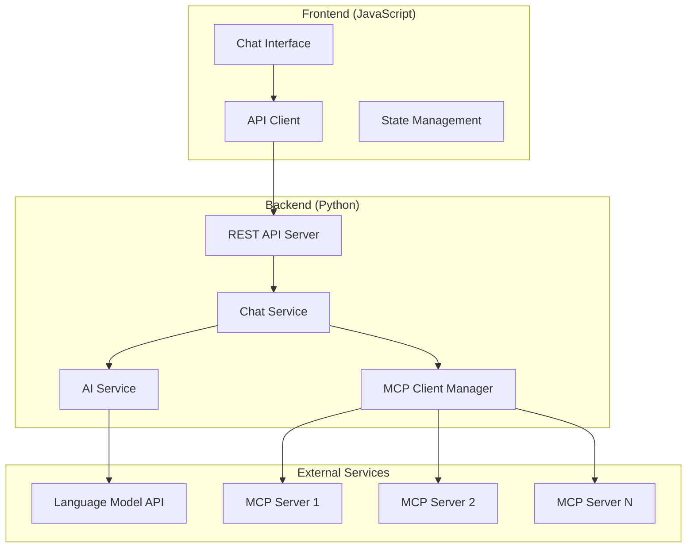

# Design Document

## Overview

The MCP Chatbot Web Application is a full-stack solution consisting of a JavaScript frontend and Python backend that enables users to interact with an AI chatbot capable of leveraging Model Context Protocol (MCP) servers for enhanced responses. The system follows a clean separation of concerns with RESTful API communication between components.

## Architecture



The architecture follows a layered approach:
- **Presentation Layer**: JavaScript frontend with responsive UI
- **API Layer**: Python REST API server handling HTTP requests
- **Business Logic Layer**: Chat service orchestrating AI and MCP interactions
- **Integration Layer**: MCP client manager and AI service for external communications

## Components and Interfaces

### Frontend Components

#### Chat Interface Component
- **Purpose**: Main UI component for user interaction
- **Responsibilities**:
  - Render chat messages with proper formatting
  - Handle user input and form submission
  - Display loading states and error messages
  - Manage responsive layout
- **Key Methods**:
  - `sendMessage(message)`: Send user message to backend
  - `displayMessage(message, sender)`: Add message to chat history
  - `showLoading()`: Display loading indicator
  - `showError(error)`: Display error message

#### API Client
- **Purpose**: Handle all HTTP communication with backend
- **Responsibilities**:
  - Make REST API calls
  - Handle request/response formatting
  - Manage error handling and retries
- **Key Methods**:
  - `sendChatMessage(message, conversationId)`: POST to /api/chat
  - `getConversationHistory(conversationId)`: GET conversation history

### Backend Components

#### REST API Server
- **Purpose**: HTTP server exposing chatbot functionality
- **Framework**: FastAPI (Python)
- **Endpoints**:
  - `POST /api/chat`: Process chat messages
  - `GET /api/conversations/{id}`: Retrieve conversation history
  - `GET /api/health`: Health check endpoint
- **Request/Response Format**:
```json
// POST /api/chat
{
  "message": "string",
  "conversation_id": "string (optional)"
}

// Response
{
  "response": "string",
  "conversation_id": "string",
  "mcp_tools_used": ["string"],
  "timestamp": "ISO 8601 string"
}
```

#### Chat Service
- **Purpose**: Core business logic for chat processing
- **Responsibilities**:
  - Orchestrate AI and MCP interactions
  - Maintain conversation context
  - Determine when to use MCP tools
  - Format responses for frontend
- **Key Methods**:
  - `process_message(message, conversation_id)`: Main chat processing
  - `determine_mcp_tools(message)`: Analyze message for tool requirements
  - `integrate_mcp_results(ai_response, mcp_results)`: Combine AI and MCP data

#### MCP Client Manager
- **Purpose**: Manage connections and communication with MCP servers
- **Responsibilities**:
  - Maintain MCP server connections
  - Route tool requests to appropriate servers
  - Handle MCP protocol communication
  - Manage authentication and error handling
- **Key Methods**:
  - `connect_to_servers(config)`: Initialize MCP connections
  - `call_tool(server_name, tool_name, parameters)`: Execute MCP tool
  - `list_available_tools()`: Get all available MCP tools
  - `health_check_servers()`: Monitor MCP server status

#### AI Service
- **Purpose**: Interface with language model API
- **Responsibilities**:
  - Send prompts to AI model
  - Manage conversation context
  - Handle AI API authentication and rate limiting
- **Key Methods**:
  - `generate_response(prompt, context)`: Get AI response
  - `build_context(conversation_history)`: Prepare conversation context

## Data Models

### Message Model
```python
class Message:
    id: str
    conversation_id: str
    content: str
    sender: str  # "user" or "assistant"
    timestamp: datetime
    mcp_tools_used: List[str]
```

### Conversation Model
```python
class Conversation:
    id: str
    messages: List[Message]
    created_at: datetime
    updated_at: datetime
```

### MCP Server Configuration
```python
class MCPServerConfig:
    name: str
    endpoint: str
    authentication: Dict[str, Any]
    available_tools: List[str]
    enabled: bool
```

### MCP Tool Call
```python
class MCPToolCall:
    server_name: str
    tool_name: str
    parameters: Dict[str, Any]
    result: Any
    execution_time: float
```

## Error Handling

### Frontend Error Handling
- **Network Errors**: Display "Connection failed" message with retry option
- **API Errors**: Show specific error messages from backend
- **Validation Errors**: Highlight invalid input fields
- **Timeout Errors**: Show timeout message and allow retry

### Backend Error Handling
- **MCP Server Unavailable**: Log error, continue with AI-only response
- **AI API Errors**: Return error response with fallback message
- **Invalid Requests**: Return 400 status with validation details
- **Internal Errors**: Log error, return 500 status with generic message

### Error Response Format
```json
{
  "error": {
    "code": "string",
    "message": "string",
    "details": "object (optional)"
  }
}
```

## Testing Strategy

### Frontend Testing
- **Unit Tests**: Test individual components with Jest
- **Integration Tests**: Test API client communication
- **E2E Tests**: Test complete user workflows with Cypress
- **Responsive Tests**: Verify UI on different screen sizes

### Backend Testing
- **Unit Tests**: Test individual services and utilities with pytest
- **Integration Tests**: Test API endpoints with test client
- **MCP Integration Tests**: Mock MCP servers for testing
- **Load Tests**: Test performance under concurrent requests

### Test Data Management
- Use fixtures for consistent test data
- Mock external API calls (AI and MCP)
- Separate test databases/configurations
- Automated test execution in CI/CD pipeline

## Security Considerations

### Authentication & Authorization
- API key management for AI services
- Secure MCP server authentication
- Rate limiting on API endpoints
- Input validation and sanitization

### Data Protection
- No persistent storage of sensitive conversation data
- Secure transmission (HTTPS)
- Environment variable management for secrets
- Logging without sensitive information

## Performance Considerations

### Frontend Optimization
- Lazy loading of chat history
- Debounced input handling
- Efficient DOM updates
- Caching of static assets

### Backend Optimization
- Connection pooling for MCP servers
- Async processing for concurrent requests
- Response caching where appropriate
- Efficient conversation context management

## Deployment Architecture

### Development Environment
- Frontend: Local development server (Vite/Webpack)
- Backend: Local Python server with hot reload
- MCP Servers: Local or development instances

### Production Environment
- Frontend: Static files served by CDN/web server
- Backend: Containerized Python application
- Load balancing for high availability
- Environment-specific MCP server configurations